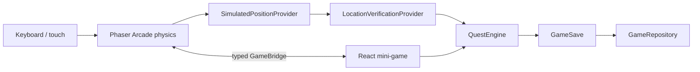

# Architecture

The composition root is PlayerProvider plus createSession. Domain code knows nothing
about React hooks, DOM nodes, or Phaser input. Change adapters here instead of changing quests.

## React and Phaser

GameCanvas imports Phaser and CampusScene inside useEffect, after hydration.
It destroys the game on unmount and handles an import completing after disposal.
Scene create builds static artwork, physics bodies, keyboard input, and subscriptions.
Scene update sets normalized velocity and publishes actual collision-resolved
positions. Shutdown removes event listeners. GameBridge belongs to the session,
not a global singleton, and returns unsubscribe callbacks.
Position events do not trigger a React render every frame.
INTERACTION_AVAILABLE/CLEARED update the UI only on radius transitions.
INPUT_CHANGED carries touch direction, PAUSE_CHANGED stops movement during dialogs,
and PROGRESS_UPDATED updates collected markers. Retained state handles late scene loading.
The UI does not read or mutate Scene internals. The scene does not grant rewards.

## Domain boundaries

PositionProvider supplies WorldPosition without depending on keyboard events.
ProximityVerificationProvider measures Euclidean distance against interactionRadius.
Verification is asynchronous so future GPS, QR, and vision can validate evidence.
QuestEngine resolves LOCKED/AVAILABLE from prerequisites, records ACTIVE,
checks location again on submission, records attempts and score, and makes COMPLETED
idempotent. It returns a new GameSave; callers must retain the latest save.
PlayerProvider guards concurrent UI submissions and writes before publishing rewards.

MiniGameRegistry maps typed kinds to reusable components. Tutorial has steps; the
other V0 kinds use configurable choices. Add a type, component and registration
to extend the UI. Add question data to campus.ts without location branches.

## Persistence and future security

GameRepository is the async contract. LocalGameRepository receives a StoragePort,
making JSON round-trip and storage failures testable without a browser.
It uses version 1 per-ID saves, checks the save shape, and preserves unreadable
data until the player explicitly resets it. Active identity is a separate pointer.
Local data is untrusted. The Supabase adapter needs authenticated transport and
atomic server-side quest completion; simply uploading arbitrary GameSave is unsafe.
AuthProvider supplies an identity independently of quest state. Prototype mode
never authenticates against EWU and never stores passwords.

## Map and progression

Map data contains five logical location centers plus independent solid building footprints.
Markers sit outside buildings so a player can reach them without entering a wall.
Coordinates are not real geography. Arcade world bounds constrain the avatar.
Progression uses 300 XP per level; 450 total XP gives level 2 with 150/300 progress.
AvatarId is stored now; customization is deferred.
