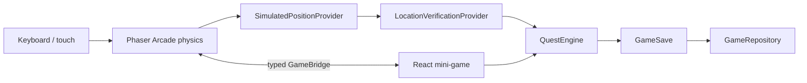

# Architecture

The composition root is PlayerProvider plus createSession. Domain code knows nothing
about React hooks, DOM nodes, or Phaser input. Change adapters here instead of changing quests.

## React and Phaser

GameCanvas imports Phaser and CampusScene inside useEffect, after hydration.
It destroys the game on unmount and handles an import completing after disposal.
Scene create builds static artwork, physics bodies, keyboard input, and subscriptions.
Scene update sets normalized velocity and publishes actual collision-resolved
positions. Shutdown removes event listeners. GameBridge belongs to the session,
not a global singleton, and returns unsubscribe callbacks.
Position events do not trigger a React render every frame.
INTERACTION_AVAILABLE/CLEARED update the UI only on radius transitions.
INPUT_CHANGED carries touch direction, PAUSE_CHANGED stops movement during dialogs,
and PROGRESS_UPDATED updates collected markers. Retained state handles late scene loading.
The UI does not read or mutate Scene internals. The scene does not grant rewards.

## Domain boundaries

PositionProvider supplies WorldPosition without depending on keyboard events.
ProximityVerificationProvider measures Euclidean distance against interactionRadius.
Verification is asynchronous so future GPS, QR, and vision can validate evidence.
QuestEngine resolves LOCKED/AVAILABLE from prerequisites, records ACTIVE,
checks location again on submission, records attempts and score, and makes COMPLETED
idempotent. It returns a new GameSave; callers must retain the latest save.
PlayerProvider guards concurrent UI submissions and writes before publishing rewards.

MiniGameRegistry maps typed kinds to reusable components. Tutorial has steps; the
other V0 kinds use configurable choices. Add a type, component and registration
to extend the UI. Add question data to campus.ts without location branches.

## Persistence and future security

GameRepository is the async contract. LocalGameRepository receives a StoragePort,
making JSON round-trip and storage failures testable without a browser.
It uses version 1 per-ID saves, checks the save shape, and preserves unreadable
data until the player explicitly resets it. Active identity is a separate pointer.
Local data is untrusted. The Supabase adapter needs authenticated transport and
atomic server-side quest completion; simply uploading arbitrary GameSave is unsafe.
AuthProvider supplies an identity independently of quest state. Prototype mode
never authenticates against EWU and never stores passwords.

## Map and progression

Campus data lives in src/game/data/campus: typed floor modules call the shared
geometry factory, buildings declare service limits, connections define persistent
core identities, and POIs carry their own evidence. The renderer consumes this
data; it does not define navigation. Rectified pixel coordinates are not GPS.

collisionRects derives the perimeter of the union of walkable areas, then adds
interior walls and solid furniture. Phaser, save restoration, integrity tests,
and the atlas consume those same bounds. Room gaps must accommodate the centred
18px avatar body. Reachability tests catch isolated-but-walkable markers.

A lift serves only the floors listed for that building; stairs offer adjacent
entries in their core's service list. The scene validates source-floor service
and proximity before travel. During the fade it stops publishing the retiring
player position, then restarts at the destination's same-core landing.
PositionProvider publishes building, floor and x/y independently of input.
Proximity verification checks building and floor as well as radius.

PlayerProvider periodically persists location and discoveries through the existing
repository. Save schema version stays 1 for compatibility, with worldRevision 2
identifying the campus coordinates. Old coordinates are never interpreted as V0.2
coordinates. Roof-only, unknown, nonfinite and colliding positions fall back.

Calibration stays behind NODE_ENV=development in both the scene and reference API.
The API selects only known floor filenames; URL input never becomes a file path.
Both reference variants are local-only. Production returns 404 before file access.
Progression uses 300 XP per level; 450 total XP gives level 2 with 150/300 progress.
AvatarId is stored now; customization is deferred.
